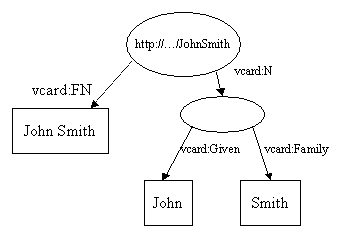

## 前言

本文是一篇对W3C的资源描述框架(RDF)和Jena(一个Java的RDFAPI)的教程性介绍。本文是为那些不熟悉RDF的，以及那些通过建立原形可以达到最好学习效果的，或是因为其他原因希望能快速操作Jena的程序员而写的。我们假设读者在阅读本文前已具有一定的XML和Java知识。

如果读者在没有理解RDF数据模型的基础上就迅速进入操作阶段，往往会导致失败和失望。然而，如果光学习数据模型又是十分枯燥乏味的，并常常会导致曲折的形而上学的难题。更好的学习办法是在理解数据模型的同时练习操作它。可以先学习一点数据模型再动手试一试。然后在学习一点再试一试。这样一来就能达到理论实践相结合的效果。数据模型本身十分简单，所以学习过程不会太长。

因为RDF具有XML的语法，所以许多熟悉XML的人就会认为以XML语法的形式来思考RDF。然而，这是不对的。RDF应该以它数据模型的形式来被理解。RDF数据可是用XML来表示，但是理解数据模型的重要性更在理解此语法重要性之上。

## 目录

1. 导言
1. Statements
1. Writing RDF
1. Reading RDF
1. Controlling Prefixes
1. Jena RDF Packages
1. Navigating a Model
1. Querying a Model
1. Operations on Models
1. Containers
1. More about Literals and Datatypes
1. Glossary

## 导言

资源描述框架是(RDF)是描述资源的一项标准(在技术上是W3C的推荐标准)。什么是资源？这实在是一个很难回答的问题，其精确的定义目前尚在争论中。出于我们的目的，我们可以把资源想象成任何我们可以确定识别的东西。在本教程中，读者你本身就是一个资源，而你的主页也是一个资源，数字1和《Moby Dick》（《白鲸记》）中巨大的白鲸都是资源。

在本教程中，我们的例子会围绕**人物**展开。假设使用VCARDS描述**人物**，而VCARD将由RDF表示机制来描述。我们最好把RDF考虑成由结点和箭头的形式构成的图。一个简单的vcard在RDF中可能看起来是这样的：


资源JohnSmith在图中用椭圆表示，并被一个统一资源定位符(URI)所标识，在本例中是"http://.../JohnSmith"。如果你想要通过你的浏览器来访问这个资源的话，你很有可能会失败。四月的愚人节笑话并不经得起考验，相反如果你的浏览器把JohnSmith传递到你的桌面的话，你才该感到惊讶。如果你并不熟悉URI's的话，你可以把它们想象成简单的陌生名字。

资源拥有属性(property)。在这些例子中，我们对JohnSmith名片上出现的那些属性很感兴趣。图1只显示了一个属性，JohnSmith的全名。属性是由标有属性名的箭头表示的。属性的名字也是一个URI，但是由于URI十分冗长笨重，所以图中将它显示为XMLqname的形式。在':'之前的部分称为命名空间前缀并表示了一个命名空间。在':'之后的部分称为局部名，并表示在命名空间中的一个名字。在写成RDFXML形式时，属性常常以qname的形式表示，这是一个在图形和文本中的简单的缩写方法。然而，严格地讲，属性应该用URI来标识。命名空间前缀:局部名的形式是一种命名空间连接局部名的URI缩写。当浏览器访问时，用并没有强制属性的URI必须指向一些具体的事物。

每个属性都有一个值。在此例中，值为一个文本(literal)，我们现在可以把它看成一个字符串。文本在图中显示为长方形。 

Jena是一个JavaAPI，我们可以用它来创建和操纵诸如上述例图的RDF图。Jena设有表示图(graph)，资源(resource)，属性和文本(literal)的对象类。表示资源，属性和文本的接口分别称为Resource，Property，和Literal。在Jena中，一个图(graph)被称为一个模型并被Model接口所表示。

创建上述例图或称为上述模型的代码很简单:

```Java
// some definitions
static String personURI    = "http://somewhere/JohnSmith";
static String fullName     = "John Smith";

// create an empty Model
Model model = ModelFactory.createDefaultModel();

// create the resource
Resource johnSmith = model.createResource(personURI);

// add the property
 johnSmith.addProperty(VCARD.FN, fullName);
```

这些代码先定义了一些常量，然后使用了ModelFactory类中的createDefaultMode()方法创建了一个空的基于内存存储的模型(Model或model)。Jena还包含了Model接口的其他实现方式。例如，使用关系数据库的，这些类型Model接口也可以从ModelFactory中创建。

于是JohnSmith这个资源就被创建了，并向其添加了一个属性。此属性由一个"常量"(constant)类VCARD提供，这个类保存了在VCARD模式(schema)中所有定义的表示对象。Jena也为其他一些著名的模式提供了常类的表示方法，例如:RDF和RDF模式(RDF schema)，Dublin核心标准和OWL。

这个例子的工作代码可以在Jena发布的材料的教程包中的Tutorial1中找到。作为练习，你自己可以获得此代码并修改其以创建一个简单VCARD。

创建资源和添加属性的代码可以写成更紧凑的层叠形式:

```Java
Resource johnSmith =
        model.createResource(personURI)
             .addProperty(VCARD.FN, fullName);

```

现在让我们为vcard再增加一些更详细的内容，以便探索更多的RDF和Jena的特性。

在第一个例子里，属性值为一个文本。然而RDF属性也可以采用其他的资源作为其属性值。下面这个例子使用常用的RDF技术展示了如何表示JohnSmith名字的不同部分:




在这里我们增加了一个新的属性，vcard:N，来表示JohnSmith名字的结构。这个模型有几点有趣之处。注意属性vcard:N使用一个资源作为起属性值。同时注意代表复合名字的椭圆并没有URI标识。它被认为是一个空白结点(blankNode)。

创建此例的Jena代码也十分简单。首先是一些声明和对空模型的创建。

```Java
// some definitions
String personURI    = "http://somewhere/JohnSmith";
String givenName    = "John";
String familyName   = "Smith";
String fullName     = givenName + " " + familyName;

// create an empty Model
Model model = ModelFactory.createDefaultModel();

// create the resource
//   and add the properties cascading style
Resource johnSmith
  = model.createResource(personURI)
         .addProperty(VCARD.FN, fullName)
         .addProperty(VCARD.N,
                      model.createResource()
                           .addProperty(VCARD.Given, givenName)
                           .addProperty(VCARD.Family, familyName));
```

此例的工作代码可以在Jena发布材料的教程包的Tutorial2中得到。

## 陈述

模型中的每一个箭头表示为一个陈述(statement)。每一个陈述声明了关于某个资源的某个事实。一个陈述有三部分组成。 

* 主体，也就是箭头的出发的资源。
* 谓词，也就是标识箭头的属性。
* 客体，也就是箭头所指向的那个资源或文本。

一个陈述有时也叫做一个三元组(triple)的原因就是它由三部分组成。

一个RDF模型(译者注:指Jena中的接口Model)是由一组陈述所组成的。在Tutorial2中，每调用一次addProperty函数就会在模型中增加另一个陈述。(因为一个模型是由一组陈述组成的，所以增加一个重复的陈述并不会产生任何意义。)Jena模型接口定义了一个listStatements()方法，此方法会返回一个StmtIterator类型的变量。StmtItor是Java中Iterator的一个子类型，这个StmtIterator变量重复迭代了该接口模型中的所有陈述。StmIterator类型中有一个方法nextStatement()，该方法会从iterator返回下一个陈述。(就和next()返回的一样，但是已将其映射为Statement类型)。接口Statement提供了访问陈述中主体，谓词和客体的方法。

现在我们会用使用那个接口来扩展Tutorial2，使起列出所有的创建的陈述并将它们打印出来。此例完整的代码可以在Tutorial3中找到。

```Java
// list the statements in the Model
StmtIterator iter = model.listStatements();

// print out the predicate, subject and object of each statement
while (iter.hasNext()) {
    Statement stmt      = iter.nextStatement();  // get next statement
    Resource  subject   = stmt.getSubject();     // get the subject
    Property  predicate = stmt.getPredicate();   // get the predicate
    RDFNode   object    = stmt.getObject();      // get the object

    System.out.print(subject.toString());
    System.out.print(" " + predicate.toString() + " ");
    if (object instanceof Resource) {
       System.out.print(object.toString());
    } else {
        // object is a literal
        System.out.print(" \"" + object.toString() + "\"");
    }

    System.out.println(" .");
} 
```

因为一个陈述的客体可以是一个资源也可以是一个文本。getObject()方法会返回一个类型为RDFNode的客体，RDFNode是Resource和Literal类共同的超类。为了确定本例中的客体确切的类型，代码中使用instanceof来确定其类型和相应的处理。 

运行后，此程序回产生与此相似的输出:

```
http://somewhere/JohnSmith http://www.w3.org/2001/vcard-rdf/3.0#N 413f6415-c3b0-4259-b74d-4bd6e757eb60 .
413f6415-c3b0-4259-b74d-4bd6e757eb60 http://www.w3.org/2001/vcard-rdf/3.0#Family  "Smith" .
413f6415-c3b0-4259-b74d-4bd6e757eb60 http://www.w3.org/2001/vcard-rdf/3.0#Given  "John" .
http://somewhere/JohnSmith http://www.w3.org/2001/vcard-rdf/3.0#FN  "John Smith" .
```

现在你明白了为什么模型构建会更加清晰。如果你仔细观察，就会发现上面每一行都由三个域组成，这三个域分别代表了每一个陈述的主体，谓词和客体。在此模型中有四个箭头，所以会有四个陈述。"14df86:ecc3dee17b:-7fff"是有Jena产生的一个内部标识符，它不是一个URI，也不应该与URI混淆。它只是Jena处理时使用的一个内部标号。

C的RDF核心工作小组定义了一个类似的表示符号称为N-三元组(N-Triples)。这个名字表示会使用"三元组符号(triple notation)"。在下一节中我们会看到Jena有一个内置的N-三元组写机制(N-Triples writer)。

## 写RDF

Jena 有提供接口方法读写XML形式的RDF。这些方法可以被用来将一个RDF模型保存到文件，以及之后重新将其读回。
创建了一个模型并将其以三元组的形式输出。教程4对教程3中的代码做了修改，使其将此模型以RDFXML的形式输出到标准输出流中。这个代码依然十分简单:model.write可以带一个OutputStream的参数。

```Java
// now write the model in XML form to a file
model.write(System.out);
```

应该有类似的输出:

```Java
<rdf:RDF
  xmlns:rdf='http://www.w3.org/1999/02/22-rdf-syntax-ns#'
  xmlns:vcard='http://www.w3.org/2001/vcard-rdf/3.0#'
 >
  <rdf:Description rdf:about='http://somewhere/JohnSmith'>
    <vcard:FN>John Smith</vcard:FN>
    <vcard:N rdf:nodeID="A0"/>
  </rdf:Description>
  <rdf:Description rdf:nodeID="A0">
    <vcard:Given>John</vcard:Given>
    <vcard:Family>Smith</vcard:Family>
  </rdf:Description>
</rdf:RDF
```

RDF协议说明书规定了如何用XML的形式来表示RDF。RDF/XML的语法十分复杂。读者可以在RDF核心工作小组制定的RDF入门篇(primer)中找到更详细的指导。但是不管怎么样，让我们先简要看一下应该如何解释上面的RDF/XML输出。

RDF 常常嵌入在一个 `<rdf:RDF>`元素中。如果有其他的方法知道此XML是RDF的话，该元素是可以不写的。然而我们常常会使用它。在这个RDF元素中定义了两个在本文档中使用的命名空间。接下来是一个 `<rdf:Description>`元素，此元素描述了URI为`"http://somewhere/JohnSmith"`的资源。如果其中的rdf:about属性被省略的话，这个元素就表示一个空白结点。

`<vcard:FN>`元素描述了此资源的一个属性。属性的名字`"FN"`是属于vcard命名空间的。RDF会通过连接命名空间前缀的URI和名字局部名`"FN"`来形成该资源的URI`"http://www.w3.org/2001/vcard-rdf/3.0#FN"`。这个属性的值为文本`"John Smith"`。

`<vcard:N>`元素是一个资源。在此例中，这个资源是用一个相对URI来表示的。RDF会通过连接这个相对URI和此文档的基准URI来把它转换为一个绝对URI。

但是，在这个RDF/XML输出中有一个错误，它并没有准确地表示我们所创建的模型。模型中的空白结点被分配了一个URI。它不再是空白的了。RDF/XML语法并不能表示所有的RDF模型。例如它不能表示一个同时是两个陈述的客体的空白结点。我们用来写这个RDF/XML的'哑'writer方法并没有试图去正确的书写这个模型的子集，虽然其原本可以被正确书写。它给每一个空白结点一个URI，使其不再空白。

Jena 有一个扩展的接口，它允许新的为不同的RDF串行化语言设计的writer可以被轻易地插入。以上的调用会激发一个标准的'哑'writer方法。Jena也包含了一个更加复杂的RDF/XMLwriter，它可以被用携带另一个参数的write()方法所调用。

```Java
// now write the model in XML form to a file
model.write(System.out, "RDF/XML-ABBREV");

```

此writer，也就是所谓的PrettyWriter，利用RDF/XML缩写语法把模型写地更为紧凑。它也能保存尽可能保留空白结点。然而，它并不合适来输出大的模型。因为它的性能不可能被人们所接受。要输出大的文件和保留空白结点，可以用N-三元组的形式输出:

```Java
// now write the model in N-TRIPLES form to a file
model.write(System.out, "N-TRIPLES");
```

这会产生类似于教程3的输出，此输出会遵循N-三元组的规格。

## 读RDF

教程5 演示了如何将用RDFXML记录的陈述读入一个模型。在此例中，我们提供了一个小型RDF/XML形式的vcard的数据库。下面代码会将其读入和写出。注意:如果要运行这个小程序，应该把输入文件放在你的classpath所指向的目录或jar中。

```Java
 // create an empty model
 Model model = ModelFactory.createDefaultModel();

 // use the FileManager to find the input file
 InputStream in = FileManager.get().open( inputFileName );
if (in == null) {
    throw new IllegalArgumentException(
                                 "File: " + inputFileName + " not found");
}

// read the RDF/XML file
model.read(in, null);

// write it to standard out
model.write(System.out);
```

方法中的第二个参数是一个URI，它是被用来解决相对URI的。因为在测试文件中没有使用相对URI，所以它允许被置为空值。运行时，Tutorial5会产生类似如下的XML输出：

```Xml
<rdf:RDF
  xmlns:rdf='http://www.w3.org/1999/02/22-rdf-syntax-ns#'
  xmlns:vcard='http://www.w3.org/2001/vcard-rdf/3.0#'
 >
  <rdf:Description rdf:nodeID="A0">
    <vcard:Family>Smith</vcard:Family>
    <vcard:Given>John</vcard:Given>
  </rdf:Description>
  <rdf:Description rdf:about='http://somewhere/JohnSmith/'>
    <vcard:FN>John Smith</vcard:FN>
    <vcard:N rdf:nodeID="A0"/>
  </rdf:Description>
  <rdf:Description rdf:about='http://somewhere/SarahJones/'>
    <vcard:FN>Sarah Jones</vcard:FN>
    <vcard:N rdf:nodeID="A1"/>
  </rdf:Description>
  <rdf:Description rdf:about='http://somewhere/MattJones/'>
    <vcard:FN>Matt Jones</vcard:FN>
    <vcard:N rdf:nodeID="A2"/>
  </rdf:Description>
  <rdf:Description rdf:nodeID="A3">
    <vcard:Family>Smith</vcard:Family>
    <vcard:Given>Rebecca</vcard:Given>
  </rdf:Description>
  <rdf:Description rdf:nodeID="A1">
    <vcard:Family>Jones</vcard:Family>
    <vcard:Given>Sarah</vcard:Given>
  </rdf:Description>
  <rdf:Description rdf:nodeID="A2">
    <vcard:Family>Jones</vcard:Family>
    <vcard:Given>Matthew</vcard:Given>
  </rdf:Description>
  <rdf:Description rdf:about='http://somewhere/RebeccaSmith/'>
    <vcard:FN>Becky Smith</vcard:FN>
    <vcard:N rdf:nodeID="A3"/>
  </rdf:Description>
</rdf:RDF>
```

## 控制前缀

## 操纵模型

到目前为止，本教程主要讲述的是如何创建，读入和输出RDF模型。现在是时候要讲述如何访问模型中的信息。 

如果有了一个资源的URI，那么就可以用Model.getResource(String uri)来从模型获取这个资源对象。这个方法被定义来返回一个资源对象，如果它确实存在于模型中，否则的话就创建一个新的。例如，如何从模型中获取AdamSmith资源，这个模型是Tutorial5中从文件读入的:

```Java
// retrieve the John Smith vcard resource from the model
Resource vcard = model.getResource(johnSmithURI);

```

接口定义了一系列用于访问某个资源的属性的方法。Resource.getProperty(Property p)方法访问了该资源的属性。这个方法不允许通常的Java访问的转换，因为所返回的对象是Statement，而不是你所预计的Property。返回整个陈述的好处是允许应用程序通过使用它的某个访问方法来访问该陈述的客体来访问这个属性值。例如如何获取作为vcard:N属性值的资源:

```Java
// retrieve the value of the N property
Resource name = (Resource) vcard.getProperty(VCARD.N)
                                .getObject();
```

一般而言，一个陈述的客体可以是一个资源或是一个文本。所以此应用程序代码知道这个值一定是个资源，就将类型资源映射到返回的对象上。Jena的目标之一是提供会返回值为特定类型的方法，这样，应用程序就不必再做类型转换工作，也不必再编译时做类型检查工作。以上的代码片段也可以写成更方便的形式:

```Java
// retrieve the value of the N property
Resource name = vcard.getProperty(VCARD.N)
                     .getResource();
```
类似地，属性的文本值也可以被获取:

```Java
// retrieve the given name property
String fullName = vcard.getProperty(VCARD.FN)
                        .getString();
```

在这个例子中，资源vcard只有一个vcard:FN属性和一个vcard:N属性。RDF允许资源有重复的属性，例如Adam可能有超过一个的昵称。让我们假设他有两个昵称:

```Java
// add two nickname properties to vcard
vcard.addProperty(VCARD.NICKNAME, "Smithy")
     .addProperty(VCARD.NICKNAME, "Adman");
```

正如前面所提到的那样，Jena将RDF模型表示为一组陈述，所以在模型中新增一个与原有陈述有着相同的主体，谓词和客体的陈述并不会后什么作用。Jena没有定义会返回模型中存在的两个昵称中的哪一个。Vcard.getProperty(VCARD.NICKNAME)调用的结果是不确定的。Jena会返回这些值中的某一个，但是并不保证两次连续的调用会同一个值。

一个属性很有可能会出现多次，而方法Resource.listProperty(Propertyp)可以用来返回一个iterator，这个iterator会列出所有的值。此方法所返回的iterator返回的对象的类型为Statement。我们可以像这样列出所有的昵称:

```Java
// set up the output
System.out.println("The nicknames of \""
                      + fullName + "\" are:");
// list the nicknames
StmtIterator iter = vcard.listProperties(VCARD.NICKNAME);
while (iter.hasNext()) {
    System.out.println("    " + iter.nextStatement()
                                    .getObject()
                                    .toString());
}
```

此代码可以在Tutorial6中找到，运行后会产生如下输出:

```
The nicknames of "John Smith" are:
    Smithy
    Adman
```

一个资源的所有属性可以用不带参数的listStatement()方法列出。

## 查询模型

前一节讨论了如何通过一个有着已知URI的资源来操纵模型。本节要讨论查询模型。核心的JenaAPI只支持一些有限的查询原语。对于更强大查询设备RDQL的介绍不在此文档中。

列出模型所有陈述的Model.listStatements()方法也许是最原始的查询模型方式。然而并不推荐在大型的模型上使用这个方法。类似的有Model.listSubjects()，但其所返回的iterator会迭代所有含有属性的资源，例如是一些陈述的主体。

Model.listSubjectsWithProperty(Property p,RDFNode o)方法所返回的iterator跌代了所有具有属性p且p属性的值为o的资源。我们可能会预计使用rdf:type属性来搜索资源的类型属性以获得所有的vcard资源:

```Java
// list vcards
ResIterator iter = model.listSubjectsWithProperty(VCARD.FN);
while (iter.hasNext()) {
    Resource r = iter.nextResource();
    ...
}
```